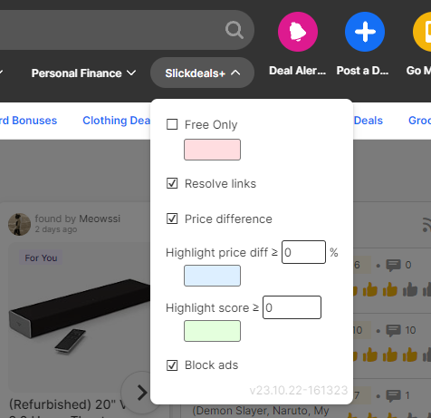
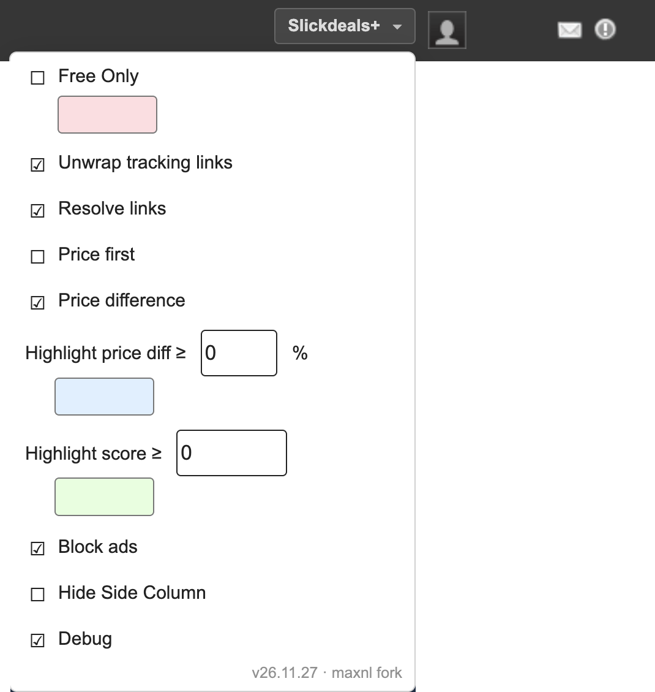

# Slickdeals+

A fork of [vanowm/slickdealsPlus](https://github.com/vanowm/slickdealsPlus) by V@no, maintained by [maxnl](https://github.com/maxnl). Version numbers here are independent of upstream's and do not correspond to them.

*Have you ever looked in DevTools while browsing slickdeals.net?*

*It's mind-boggling how much useless (to the visitor) stuff it downloads, __uploads__ to other servers and stores on your computer*

This userscript blocks most, if not all, __ads__ and __trackers__, making the site more responsive and more private — and adds a few things to make deals easier to read at a glance.

## What it does

Everything is a switch in the **Slickdeals+** menu in the site header. Settings save as you change
them and apply immediately, except where noted.

<table>
  <tr>
    <td align="center"><b>Default layout</b></td>
    <td align="center"><b>Classic layout</b></td>
  </tr>
  <tr>
    <td valign="top"></td>
    <td valign="top"></td>
  </tr>
</table>

The default-layout shot is older and shows fewer options than the table below; the classic one is
current.

| Option | What it does |
| --- | --- |
| **Free items** | Free items are always highlighted. The swatch beneath **Free Only** sets the color. |
| **Free Only** | Additionally hide everything that is not free. |
| **Unwrap tracking links** | Some Slickdeals links carry their real destination inside them. This reads it out and points the link straight at it, skipping the redirect. **Entirely local — nothing leaves your browser.** |
| **Resolve links** | For links that *don't* carry their destination, look it up. **This is the only feature that sends anything anywhere:** the link and the page URL go to a third-party service, which returns the final destination. Turn it off to keep everything local. |
| **Price first** | Show the price before the title instead of after it. |
| **Price difference** | Show the price and percent difference between the current and original prices. |
| **Highlight price diff ≥ _n_ %** | Highlight items discounted by at least _n_ percent. The swatch sets the color. |
| **Highlight score ≥ _n_** | Highlight items with at least _n_ votes. The swatch sets the color. |
| **Block ads** | Block ad and tracker requests. **Needs a page reload to take effect.** |
| **Hide Side Column** | Hide the side column on the main page (popular, trending deals, and so on). |
| **Debug** | Print what the script is doing to the browser console — what it blocked, and how each link resolved. Leave off unless you are diagnosing something. |
| **Custom CSS** | Your own CSS, applied to every page. Only appears once it has been enabled. |

A color swatch left empty uses the built-in default, and a highlight threshold of `0` turns that
highlight off.

### Unwrapping vs resolving

These are two different mechanisms, which is why they have separate switches:

* **Unwrapping** reads a destination the link already contains. No request, nothing sent anywhere.
* **Resolving** asks a third-party service for a destination the link does not contain.

Leaving **Resolve links** off keeps the benefit of unwrapping with no external lookups at all.
Resolved destinations are cached in your browser, so a link is normally looked up only once.

> **As of August 2026, unwrapping does nothing, because Slickdeals no longer supplies what it needs.**
> Across every page sampled — 248 wrapped links on deal pages, forum threads, the front page and
> category listings, plus a live thread checked again in August — **not one** carried its destination
> inside it. So in practice every link now needs **Resolve links** to be unwrapped at all, and if you
> turn **Resolve links** off today, expect links to stay wrapped.
>
> **Unwrap tracking links** is deliberately kept. It costs nothing while no link carries a
> destination, it cannot misfire, and it starts working again on its own if Slickdeals ever puts one
> back.

Some links cannot be resolved even then. Where Slickdeals hands the browser an intermediate page
rather than a redirect, there is no chain for the service to follow and it says so; those links stay
as they are, still working, and are re-checked about once a week.

### Seeing it work

A link that has been given its real destination shows green; one still waiting shows blue. On a deal
page you will usually see links go blue and then green a moment later. A link that stays blue could
not be resolved — it keeps its original Slickdeals link and still works, it just does not skip the
redirect.

## Install

Requires a userscript manager — [Tampermonkey](https://www.tampermonkey.net/) (Chrome, Edge, Firefox, Safari) or [Violentmonkey](https://violentmonkey.github.io/).

**[▶ Install Slickdeals+](https://github.com/maxnl/slickdealsPlus/releases/latest/download/Slickdeals.user.js)**

With a userscript manager installed, that link opens Tampermonkey's install prompt directly. It always serves the newest [release](https://github.com/maxnl/slickdealsPlus/releases) rather than a half-finished commit, and the script points `@updateURL` at the same place — so Tampermonkey tracks releases from then on and updates itself, with no need to revisit this page.

[Changes](https://github.com/maxnl/slickdealsPlus/commits/master)
